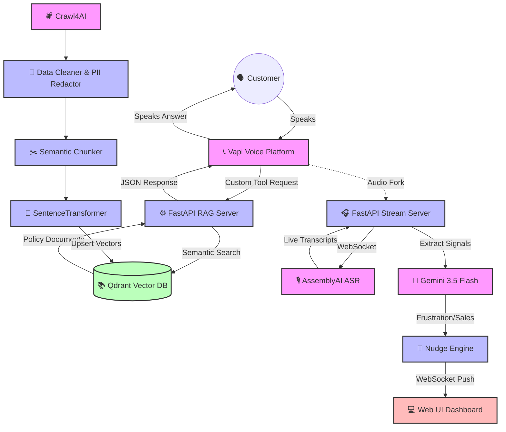

# 🚀 Production Voice AI & RAG Architecture (2026 Assessment)

Welcome! This repository contains a full-stack, enterprise-ready Voice AI architecture, engineered from scratch for the 2026 AI Engineer Assessment.

This README is designed to explain **everything we built, how it works, and why we made our technical decisions**, written simply enough for an SD-1 to grasp the flow, but with enough technical depth for an SD-3 to appreciate the architecture.

---

## 📖 What We Built

We built a real-time AI Voice Assistant system that can talk to customers over the phone or web. Instead of following a rigid script, it uses **RAG (Retrieval-Augmented Generation)** to look up actual company policies instantly. We also built a system to listen in on calls and send real-time alerts (Nudges) to human supervisors if a customer gets frustrated.

The project is divided into four main parts:
1. **The Voice Agent (Question 1):** A web-calling interface powered by Vapi that talks to users about Health Insurance.
2. **The Knowledge Base (Question 2):** A vector database (Qdrant) filled with scraped, cleaned, and embedded policy documents. The voice agent searches this database instantly when a user asks a complex question.
3. **Multilingual Routing (Question 3):** Localized voice agents specifically tuned for the Philippines (Taglish) and Indonesia (Bahasa), complete with regional terminology and custom system prompts.
4. **Live Insights Pipeline (Question 4):** A real-time background server that listens to audio streams, transcribes them using AssemblyAI, and uses Gemini 3.5 Flash to detect compliance risks, missed sales opportunities, and frustration—alerting the dashboard instantly with End-to-End latency tracking.

---

## 🏗 System Architecture & Flow

Here is a high-level view of how data flows through the system during an active call:



---

## 🛠 How to Set Up and Run the Code

Follow these exact steps to start the entire system on your local machine.

### 1. Installation
Create a Python virtual environment and install the required dependencies:
```bash
python3 -m venv venv
source venv/bin/activate
pip install -r requirements.txt
```

### 2. Configuration (`.env`)
Copy `.env.example` to `.env` and fill in your actual API keys (Vapi, Gemini, Qdrant, etc.). 
```bash
cp .env.example .env
```
> **SD-3 Detail:** The backend features a fast-fail configuration validator (`shared/config.py`). If you forget critical keys, the server refuses to boot, preventing silent crashes later.

### 3. Build the Knowledge Base (Q2)
Scrape the fake insurance websites, clean out bad HTML data, generate embeddings locally, and push them into the Qdrant database:
```bash
python -m q2_knowledge_base.pipeline
```

### 4. Start the Unified Server (Q1, Q2, Q4 Dashboard)
We unified all our APIs (RAG Search, Live Insights, and Web Dashboard) into a single FastAPI application. Start it:
```bash
python server.py
```
*The server is now running on `http://localhost:8080`.*

### 5. Expose Your Server to the Internet
Because Vapi (the voice platform) lives in the cloud, it needs a public URL to talk to your local laptop to access the Knowledge Base.
```bash
# In a new terminal window:
ngrok http 8080
export NGROK_URL=https://your-ngrok-url.ngrok.app
```

### 6. Provision the Voice Agents (Q1 & Q3)
Run our provisioning scripts to automatically create the Voice Agents in your Vapi account. These scripts configure the LLMs (Gemini 3.5 Flash), the custom tools, and the prompts.
```bash
# Provision the English Bot (Q1)
python -m q1_voice_agent.provision

# Provision the Multilingual Bots (Q3)
python -m q3_multilingual.provision ph   # Philippines (Taglish)
python -m q3_multilingual.provision id   # Indonesia (Bahasa)
```
> **SD-2 Detail:** These scripts are **idempotent**. If you run them twice, they `PATCH` (update) the existing bot instead of creating duplicates.

### 7. Test it Out!
Open `http://localhost:8080` in your web browser. 
- You can search the knowledge base directly in the UI.
- You can click the **Start Call** buttons to talk to the Voice Agents through your computer's microphone.
- You can click **Start Simulated Call** on the Live Insights tab to watch the real-time AI nudges appear!

---

## 🧠 Our Technical Approach & Challenges Solved

### Question 1: Knowledge-Grounded Voice Agent
**Approach:** We chose Vapi as our Voice Platform and Gemini 3.5 Flash as our LLM. To ground the agent, we used **Function Calling (Custom Tools)**. When a user asks a hard question, the LLM pauses, makes an API request to our local FastAPI server (`/q2/api/v1/search`), reads the exact policy chunk returned by Qdrant, and synthesizes an accurate answer.
**Challenge Solved:** Initially, the LLM hallucinated answers if the knowledge base returned irrelevant documents. We fixed this by enforcing a strict `score_threshold=0.3` in the Qdrant retrieval layer to block low-confidence vectors.

### Question 2: Production-Ready Knowledge Base
**Approach:** We built a data pipeline (`scraper -> cleaner -> chunker -> embedder`). We used `SentenceTransformers` to generate embeddings locally to save API costs.
**Challenge Solved (Idempotency):** Python's `hash()` function is randomized per run. When generating chunk IDs for Qdrant, we were creating a new UUID every time the pipeline ran, causing massive vector duplication. We solved this by using deterministic MD5 hashing (`hashlib.md5(text.encode())`), ensuring Qdrant safely overwrites updates instead of duplicating data.

### Question 3: Native-Language Voice Bots
**Approach:** We provisioned two separate agents for the Philippines (Taglish) and Indonesia (Bahasa). 
**Challenge Solved:** Legacy speech-to-text models fail at "code-switching" (e.g., mixing Tagalog and English loanwords like "lapse" or "premium" in the same sentence). We solved this by explicitly configuring the Vapi transcriber to use the `multi` language model setting, which natively supports rapid code-switching without literal translations.

### Question 4: Live Insights and Nudges
**Approach:** We built a background Python pipeline that takes live audio, streams it to AssemblyAI for real-time transcription, and pushes completed sentences to Gemini 3.5 Flash to extract JSON signals (`missed_cross_sell`, `compliance_gap`, `frustration`). It then pushes UI nudges to the web dashboard via WebSockets.
**Challenges Solved:**
1. **Concurrency Event Loop Freezing:** Sending audio chunks over WebSockets while waiting for LLM network requests blocked the Python `asyncio` event loop. We solved this by wrapping blocking calls in `asyncio.to_thread()`, keeping the stream fast and responsive.
2. **Context Window Exhaustion:** Passing the entire transcript to Gemini over a 45-minute call would exhaust the token limit and cause a memory leak. We solved this with a sliding text window, strictly truncating `full_context` to the last 4,000 characters.
3. **Duplicate Nudge Spam:** If a user sounded angry for 3 sentences, it spawned 3 alerts. We built a `NudgeEngine` with a 15-second `suppression_window_ms` (cooldown) to filter out duplicate topics.
4. **End-to-End Latency Tracking:** We capture a precise timestamp when the transcript string finishes, measure the LLM extraction time, and finally compute total `E2E_ms` (End-To-End) right before pushing the WebSocket payload, displaying the speed dynamically on the UI dashboard card.

---

## 📂 Codebase Structure

```text
├── shared/                  
│   ├── config.py            # Centralized environment configs with fast-fail validation
│   └── logger.py            # JSON structured logging
├── q1_voice_agent/          
│   ├── provision.py         # Idempotent Vapi API deployment
│   ├── system_prompt.py     # Base rules & behavior guidelines
│   └── tools.py             # JSON Schema for the Knowledge Base Custom Tool
├── q2_knowledge_base/       
│   ├── pipeline.py          # Master script combining crawling, cleaning, and embedding
│   └── api.py               # Secure FastAPI Retrieval Endpoint
├── q3_multilingual/         
│   ├── provision.py         # Deployment router for specific language bots
│   ├── philippines/         # Taglish agent setup
│   └── indonesia/           # Bahasa agent setup
├── q4_live_insights/        
│   ├── server.py            # Concurrency-locked WebSocket Server
│   ├── pipeline.py          # Real-time orchestration (Transcriber -> Signal -> Nudge)
│   ├── signal_extractor.py  # Gemini LLM JSON extraction with API backoff retries
│   ├── nudge_engine.py      # Duplicate suppression and cooldown logic
│   └── templates/dashboard.html # Auto-reconnecting frontend UI
├── web/                     # Frontend UI (HTML/CSS/JS)
└── server.py                # The Unified Global Application Bootstrapper
```
