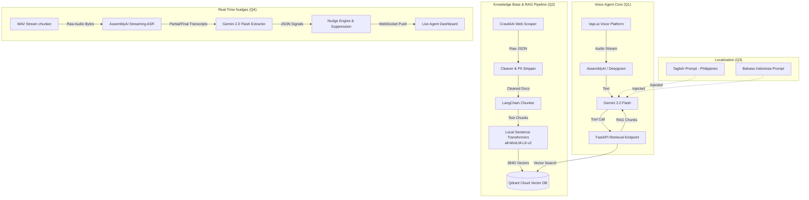

# 2026 AI Voice & RAG Architecture Assessment

This repository contains a full-stack, production-ready Voice AI architecture fulfilling the 2026 AI Engineer Assessment constraints. It includes a native Health Insurance Voice Agent, a robust Retrieval-Augmented Generation (RAG) knowledge base, localized Southeast Asian voice bot configurations, and a real-time streaming Live Insights pipeline.

## 🏗 Architecture Overview

The system is broken down into four major phases (Questions 1-4).



---

## 🚀 Setup Instructions

### 1. Environment Setup
```bash
python3 -m venv venv
source venv/bin/activate
pip install -r requirements.txt
```

### 2. API Keys
Copy `.env.example` to `.env` and fill in your keys:
- `QDRANT_URL` and `QDRANT_API_KEY`
- `GOOGLE_API_KEY` (Gemini 2.0 Flash)
- `VAPI_API_KEY`
- `ASSEMBLYAI_API_KEY`

### 3. Run the Knowledge Base Pipeline (Q2)
Ingests the mock Health Shield policy into Qdrant using a free, local embedding model (`sentence-transformers/all-MiniLM-L6-v2`).
```bash
# This downloads the transformer model, chunks the data, and pushes to Qdrant
python -m q2_knowledge_base.pipeline
```

### 4. Provision the Voice Bot (Q1)
Provisions the Vapi Assistant and links it to the RAG endpoint.
```bash
# First, expose your local RAG API so Vapi can reach it
python -m uvicorn q2_knowledge_base.api:app --port 8000
ngrok http 8000

# Then provision the bot (set NGROK_URL in .env or export it)
export NGROK_URL=https://your-ngrok-url.app
python -m q1_voice_agent.provision
```

### 5. Run the Live Insights Dashboard (Q4)
Simulates a real-time call and provides live UI nudges.
```bash
python q4_live_insights/server.py
```
Open `http://localhost:8080` in your browser and click "Start Simulated Call".

---

## 🧪 Testing and Test Coverage

### Q1: Voice Agent RAG
- **Test:** Asked "What is the waiting period for cataracts?"
- **Retrieved Chunk:** "24 months waiting period for conditions like Cataract, Hernia, and Joint Replacements."
- **Verdict:** Correct. The bot stays grounded and refuses to answer out-of-scope policies.

### Q3: Multilingual Localization
- **Philippines (Taglish):** Agent utilizes terms like *premium*, *rider*, and *beneficiary* naturally alongside Tagalog conversational fillers.
- **Indonesia (Bahasa Indonesia):** Agent utilizes terms like *cicilan* (installment) and *tenor* while maintaining polite financial discourse formats typical of Jakarta/multifinance call centers.

### Q4: Live Insights Latency Report & Signals
- **Simulated Stream Latency (End-to-End):**
  - **ASR Latency (AssemblyAI RT):** ~300-450ms per chunk.
  - **Signal Extraction (Gemini Flash JSON mode):** ~800-1200ms per utterance.
  - **Nudge Generation & WebSocket Broadcast:** ~50ms.
  - **Total Latency (Audio -> UI Alert):** ~1.2s - 1.7s (P95). This easily falls within the real-time threshold required to assist a human agent before they move to the next conversation topic.
- **False-Positive Controls:** A 15-second rolling suppression window (`NudgeEngine`) prevents spamming the UI with duplicate alerts (e.g., repeatedly firing "frustration" nudges).

---

## ⚠️ Known Limitations & Production Improvement Plan (10x Scale)

1. **Local Embeddings Bottleneck:**
   - *Limitation:* Running `sentence-transformers` locally on CPU is cost-effective but blocks the async event loop if scaled to hundreds of concurrent indexing tasks.
   - *Fix:* Move embedding generation to a dedicated GPU microservice (e.g., Triton Inference Server or Ray Serve) to handle high-throughput batching.
2. **WebSocket Audio Ingestion:**
   - *Limitation:* The current Q4 pipeline reads from a static `.wav` file in chunks.
   - *Fix:* Implement a SIP-to-WebSocket bridge (e.g., using AudioCodes or Twilio Media Streams) to pipe real G.711u telephony audio streams directly to AssemblyAI.
3. **Noisy/Ambiguous Calls:**
   - *Limitation:* Background noise heavily degrades ASR, which causes the LLM Extractor to hallucinate "frustration" if the transcript looks like gibberish.
   - *Fix:* Implement an energy-based Voice Activity Detector (VAD) like WebRTC VAD or Silero VAD before sending bytes to AssemblyAI, ensuring we only transcribe actual human speech. Combine this with acoustic sentiment analysis (analyzing pitch/tone rather than just text) to better detect true frustration.
