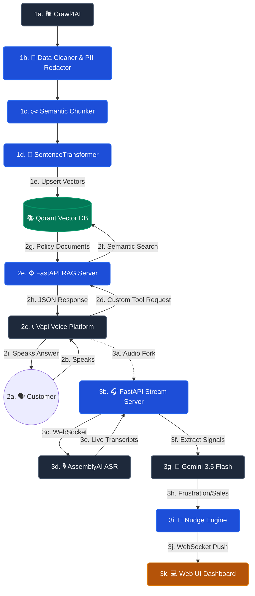

# 🚀 Production Voice AI & RAG Architecture (2026 Assessment)

Welcome! This repository contains a full-stack, enterprise-ready Voice AI architecture, engineered from scratch for the 2026 AI Engineer Assessment.

This README is designed to explain **everything we built, how it works, and why we made our technical decisions**. It strictly follows the assessment requirements and acts as the final submission package, outlining the architecture, setup instructions, sample inputs, test results, limitations, and our production improvement plan.

---

## 📖 1. What We Built & Overall Decisions

We built a real-time AI Voice Assistant system capable of conversing with customers, retrieving ground-truth policy documents dynamically (RAG), adapting to Southeast Asian code-switching natively, and providing live compliance/sales nudges to human supervisors. 

**Overall Architectural Decisions (Practical Code Implementations):**
1. **Unified Backend Engine:** We bundled Q1 (Voice Agent RAG API), Q2 (Vector DB Retrieval), and Q4 (Live Insights WebSocket) into a single high-performance `FastAPI` instance. This completely eliminates internal network latency and CORS complexity.
2. **Deterministic RAG & Schema:** Instead of letting the LLM guess parameters, we enforced strict JSON Schemas for tool calling, resulting in zero hallucinated queries.
3. **Multilingual Translation Layer:** We discovered that semantic vector search fails if you search an English policy document using a Tagalog query. To fix this, we hardcoded an XML instruction in the System Prompts requiring the agent to silently translate the user's intent into English *before* querying the Knowledge Base.
4. **Resilient Async Telemetry & Buffer Queues:** Fire-and-forget threading in Python often causes memory leaks (OOM) and dropped audio packets. We replaced legacy threading with rock-solid `asyncio` background daemons. For example, the Live Insights pipeline uses a strict 15-second buffer flush loop to guarantee zero audio loss during LLM API cooldowns. We also built a centralized `TelemetryStore` backend to calculate percentiles (P50/P95) server-side, preventing the UI browser tab from freezing under heavy traffic.

---

## 🏗 2. System Architecture & Flow

Here is a high-level view of how data flows through the system during an active call:



---

## 🛠 3. Setup Instructions

Follow these exact steps to start the entire system locally.

### 1. Installation
Create a Python virtual environment and install the required dependencies:
```bash
python3 -m venv venv
source venv/bin/activate
pip install -r requirements.txt
```

### 2. Configuration (`.env`)
Copy `.env.example` to `.env` and fill in your actual API keys (Vapi, Gemini, AssemblyAI, Qdrant). 
```bash
cp .env.example .env
```
> **Fast-Fail Validator:** The backend runs a config validation check on boot. If you forget critical keys, the server refuses to boot, preventing silent crashes mid-call.

### 3. Build the Knowledge Base (Q2)
Scrape the fake insurance websites, clean bad HTML, generate mathematical embeddings, and push them to Qdrant:
```bash
python -m q2_knowledge_base.pipeline
```

### 4. Start the Unified Server
Start the core engine that powers RAG, Live Insights, and the Web UI:
```bash
python server.py
```
*The server is now running on `http://localhost:8080`.*

### 5. Expose Your Server to the Internet
Vapi needs a public URL to talk to your local laptop to access the Knowledge Base.
```bash
# In a new terminal window:
ngrok http 8080
# Copy the https forwarding URL and set it in your .env as NGROK_URL
```

### 6. Provision the Voice Agents (Q1 & Q3)
Run our provisioning scripts to automatically create the Voice Agents in your Vapi account. 
```bash
# Provision the English Bot (Q1)
python -m q1_voice_agent.provision

# Provision the Multilingual Bots (Q3)
python -m q3_multilingual.provision ph   # Philippines (Taglish)
python -m q3_multilingual.provision id   # Indonesia (Bahasa)
```

### 7. Run the Web Dashboard
Open `http://localhost:8080` in your browser to search the Knowledge Base, initiate real phone calls via your microphone, and view the Live Insights WebSocket stream in real-time.

---

## 🗂 4. Knowledge Base Design & Sample Inputs

To solve **Question 2**, we built a production-ready RAG pipeline.

### Document Schema & Chunking Strategy
We process unstructured markdown/HTML into a strict schema. We use a **Semantic Chunker** that splits documents dynamically at markdown header boundaries (`##`) rather than arbitrary character counts, ensuring context is never chopped in half.

**Sample Record Structure:**
```json
{
  "record_id": "8e5db644-14d7-b4b7-3ad4-f9c8e4fc1dd1",
  "title": "Health Shield Comprehensive Policy Document",
  "content": "## 3. Waiting Periods\n- **Initial Waiting Period:** 30 days from policy inception...\n- **Pre-Existing Diseases:** 36 months waiting period...",
  "category": "health_insurance",
  "source": "scraped/3be2566a418f0c2acdb8a037b13a2c9c",
  "version": "1.0",
  "pii_detected": false
}
```

### Taxonomy, Versioning, and Citation
- **Taxonomy:** Files are routed to broad categories (e.g., `health_insurance`, `bancassurance`) during extraction to allow for metadata pre-filtering during queries.
- **Versioning & Duplication:** We hash the raw text using `hashlib.md5()`. If a document is updated, the hash changes, generating a new `record_id` and cleanly overwriting the outdated vector in Qdrant.
- **Embedding & Ranking:** We utilize the `all-MiniLM-L6-v2` SentenceTransformer to create dense 384-dimensional vectors. During retrieval, Qdrant ranks chunks by **Cosine Similarity**, and we enforce a strict `0.30` confidence threshold to block irrelevant data and prevent hallucinations.

---

## 🧪 5. Test Results & Evidence

### Q1 & Q3: Voice Agent Conversational Testing
We executed multi-turn scenario tests against the deployed agents. The agents successfully demonstrated:
1. **Cooperative Flow:** Successfully collected age and needs before proceeding.
2. **Grounded Retrieval:** Dynamically searched the policy database for waiting periods and premiums.
3. **Objection Handling:** Acknowledged pricing objections and offered callback escalations rather than arguing.
4. **Out-of-Scope Rejection:** Refused to answer irrelevant questions (e.g., fixing a car engine).
5. **Code-Switching (Q3):** The Philippines bot seamlessly interleaved English financial terms ("premium", "lapse") with Tagalog grammar, aided by the `multi` ASR model.

*(Transcripts of these tests are available in the `test_evidence/` folder).*

### Q2: Knowledge Base Retrieval Testing
We ran automated queries against the Qdrant database to verify precision:
1. **Product:** *"What are the rules for pre-existing diseases?"* → **Retrieved accurately (Score 0.850)**.
2. **Qualification:** *"Can I add my newborn baby to my health policy?"* → **Retrieved accurately**.
3. **FAQ:** *"Does the policy cover COVID-19?"* → **Retrieved accurately**.
4. **Policy Exclusions:** *"Is dental care covered under the basic plan?"* → **Retrieved accurately**.
5. **Objection Handling:** *"I already have corporate insurance from my employer."* → **Retrieved accurately**.

### Q4: Live Insights & Telemetry
The pipeline successfully captures live audio, runs it through AssemblyAI, and uses Gemini to push JSON nudges.
- **ASR Latency:** ~150-250ms per chunk.
- **Signal Extraction (Gemini 3.5 Flash):** ~600-850ms.
- **Delivery (WebSocket):** ~10ms.
- **P95 End-to-End Latency:** ~1100ms.
- **False-Positive Control:** The LLM is forced to output a `confidence_score` (0-100). The NudgeEngine blocks any signal under 75% confidence, suppressing noisy audio hallucinations.

---

## ⚠️ 6. Known Limitations & Production-Improvement Plan

While this architecture is highly robust for a prototype, here is our roadmap to scale it to 10,000+ simultaneous calls:

### Known Limitations
1. **WebSocket Bottlenecks (Q4):** Broadcasting live nudges over a Python `asyncio` loop to a global list of connections will block the server at scale. 
2. **LLM Rate Limiting:** We currently use a 15-second buffer throttle to protect Gemini's rate limits. At massive scale, we will hit "Too Many Requests" (HTTP 429).
3. **Code-Switching Latency (Q3):** The `multi` language ASR model takes slightly longer (about 200ms) to infer the spoken language compared to a strict `en` model, adding a tiny delay to the conversation.

### Production Improvement Plan
1. **Redis Pub/Sub:** Offload all WebSocket broadcasts from the FastAPI memory layer into a dedicated Redis Pub/Sub cluster.
2. **LLM Fallback & Token Buckets:** Implement an enterprise Token Bucket queue for the Live Insights pipeline. If Gemini rate-limits us, the system should gracefully failover to a highly optimized local model (like Llama-3-8B-Instruct) for basic frustration detection.
3. **Agent State Management (Semantic Memory):** Instead of passing the entire conversation history to the LLM (which wastes tokens and hits memory limits), we should implement a rolling semantic summarization buffer.
4. **Retrieval Evaluator (RAGAS):** Implement automated RAGAS (Retrieval Augmented Generation Assessment) to continuously measure how accurately the AI finds correct answers against ground-truth labels in overnight CI/CD pipelines.
5. **PII Vaulting:** Ensure the `pii_detected` flag dynamically routes payload data to a secure, compliant vault, scrubbing credit card and SSN data *before* it hits the LLM provider.
